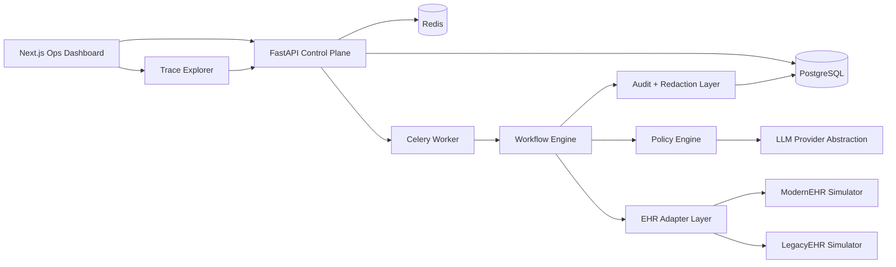

# Universal Clinic Workflow Orchestrator

Open-code MVP for reliable clinic workflow automation across heterogeneous EHR interfaces with strong observability, human fallback, auditability, and minimal PHI persistence.

## What It Demonstrates

- Deterministic workflow execution with reusable JSON templates
- Simulated automation against two EHR styles: `ModernEHR` and `LegacyEHR`
- Context and policy engine with rule-first decisions and optional LLM ambiguity resolution
- Human handoff queue for low-confidence or inconsistent states
- Redacted audit trail with immutable application-level records
- Operations dashboard with workflow analytics, traces, and simulator views
- Dockerized local development with PostgreSQL, Redis, FastAPI, Celery, and Next.js

## Architecture



## Monorepo Structure

```text
backend/                 FastAPI app, workflow engine, simulators, worker
frontend/                Next.js dashboard
shared/workflow-templates Reusable workflow definitions
docs/                    Architecture notes and screenshots
infra/                   Deployment support files
docker-compose.yml       Local stack
```

## Implementation Phases

1. Platform scaffold: environment, containers, docs, shared workflow definitions
2. Backend core: models, APIs, workflow runner, redaction, audit, simulators, seed data
3. Frontend ops console: dashboard, queue, trace viewer, simulator, settings
4. Demo wiring: seeded clinics, runnable workflows, retry/failure/escalation paths
5. Hardening: replay mode, policy sandbox, richer telemetry, HIPAA controls

## Local Development

1. Copy `.env.example` to `.env`
2. Run `docker compose up --build`
3. API: `http://localhost:8000/docs`
4. Web: `http://localhost:3000`

## Screenshots

Placeholder screenshots can be added under `docs/screenshots/` after running the app locally.

## Future Work

- Voice integration for inbound call automation with transcript redaction
- Production EHR-specific connectors and browser session management
- HIPAA hardening: KMS-backed secrets, field-level encryption, SIEM export, SSO
- Expanded analytics: SLA adherence, time saved, recovery yield, calibration drift
