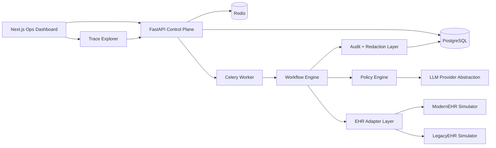

# Operational Reliability Layer for AI Employees in Clinics

Open-code MVP for the missing infrastructure layer that makes AI employees deployable inside real clinics: reliable workflow execution across messy EHRs, human fallback, redacted auditability, and minimal PHI persistence.

## Product Thesis

Most clinic AI companies can generate language, classify requests, and draft actions.

The bottleneck is operational reliability inside heterogeneous EHR environments.

This project is built around that bottleneck:

- Legacy and modern EHR interfaces break brittle automations
- Low-confidence edge cases require fast human takeover
- Clinics need step-level auditability before they trust automation
- Logs and traces must preserve operational evidence without persisting unnecessary PHI
- Business value has to be visible in recovered appointments, saved staff time, and reduced failure rates

The sharp positioning is not "another AI receptionist."

It is an operational reliability layer for clinic AI employees.

## What It Demonstrates

- Deterministic workflow execution with reusable JSON templates
- Simulated automation against two EHR styles: `ModernEHR` and `LegacyEHR`
- Context and policy engine with rule-first decisions and optional LLM ambiguity resolution
- Human handoff queue for low-confidence or inconsistent states
- Redacted audit trail with immutable application-level records
- Operations dashboard with workflow analytics, traces, and simulator views
- Dockerized local development with PostgreSQL, Redis, FastAPI, Celery, and Next.js

## Demo Narrative

The primary demo is:

`Cancellation Recovery in LegacyEHR`

Why this flow matters:

- It starts with real clinic pain: same-day cancellations create lost revenue
- It exercises the hard systems problem: interacting safely with a messy legacy UI
- It requires judgment: pick the best waitlist candidate, not just any candidate
- It forces reliable fallback: escalate when confidence drops or the UI state is inconsistent
- It ends in business value, not just technical completion

The intended reviewer takeaway is:

"This is the layer that makes AI clinic operators actually safe to deploy."

## Demo Outcome

The dashboard is designed to tell a business story, not just a systems story:

- Cancellation identified
- Best-fit patient selected from waitlist
- Slot refilled in `LegacyEHR`
- Expected revenue recovered: `$180`
- Manual staff time saved: `12 minutes`
- Workflow confidence: `0.91`
- Raw PHI persisted in logs: `none`

## Architecture



## Monorepo Structure

```text
backend/                 FastAPI app, workflow engine, simulators, worker
frontend/                Next.js dashboard
shared/workflow-templates Reusable workflow definitions
docs/                    Architecture notes and screenshots
infra/                   Deployment support files
docker-compose.yml       Local stack
```

## Implementation Phases

1. Platform scaffold: environment, containers, docs, shared workflow definitions
2. Backend core: models, APIs, workflow runner, redaction, audit, simulators, seed data
3. Frontend ops console: dashboard, queue, trace viewer, simulator, settings
4. Demo wiring: seeded clinics, runnable workflows, retry/failure/escalation paths
5. Hardening: replay mode, policy sandbox, richer telemetry, HIPAA controls

## Local Development

1. Copy `.env.example` to `.env`
2. Run `docker compose up --build`
3. API: `http://localhost:8000/docs`
4. Web: `http://localhost:3000`

## Recommended Demo Sequence

1. Seed the environment with `POST /api/seed`
2. Launch the `cancellation-recovery` workflow against the seeded enterprise clinic using `ehr_style: "legacy"`
3. Open the dashboard and trace view
4. Show the step-by-step adapter trace, confidence, fallback logic, and recovered business value

## Screenshots

Placeholder screenshots can be added under `docs/screenshots/` after running the app locally.

## Future Work

- Voice integration for inbound call automation with transcript redaction
- Production EHR-specific connectors and browser session management
- HIPAA hardening: KMS-backed secrets, field-level encryption, SIEM export, SSO
- Expanded analytics: SLA adherence, time saved, recovery yield, calibration drift
